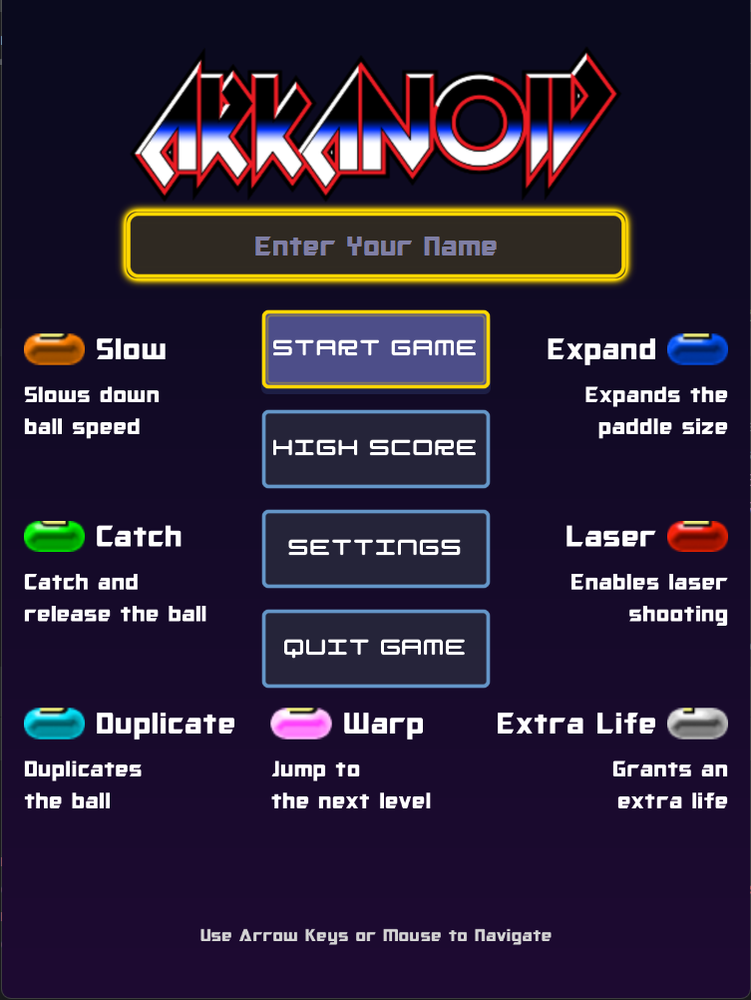
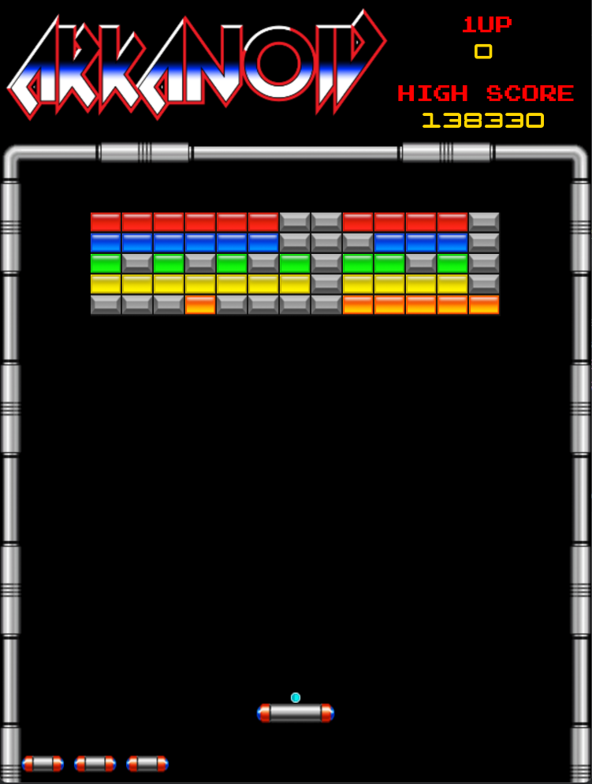
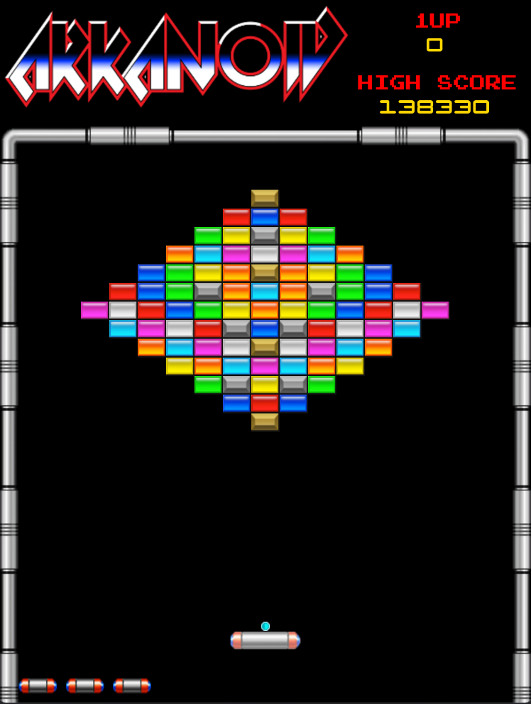
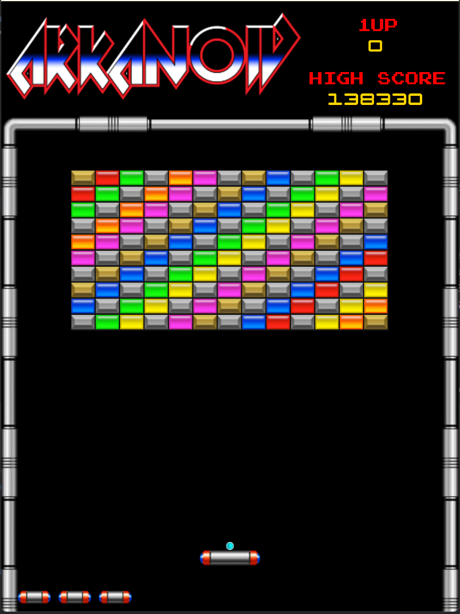
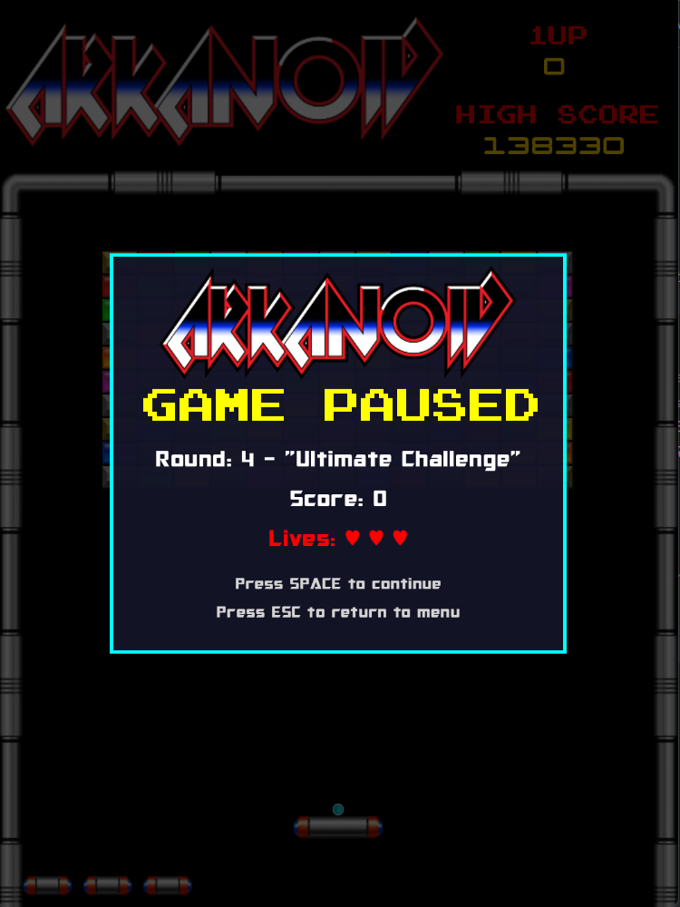
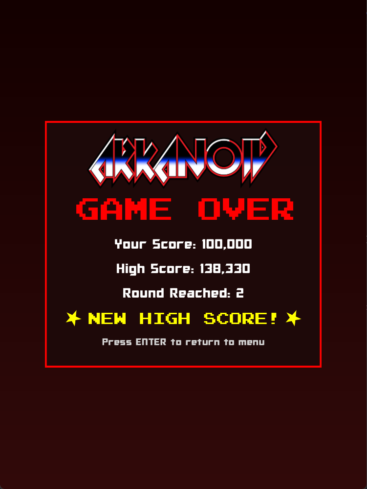
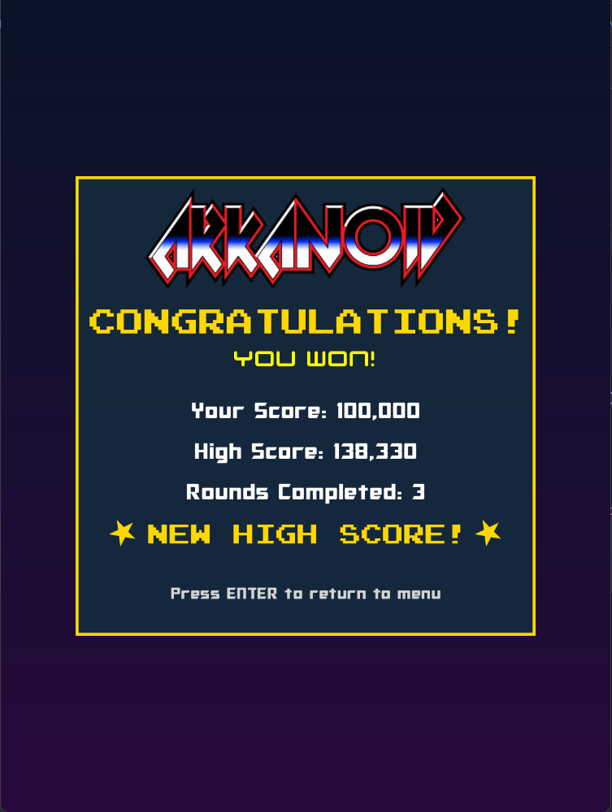
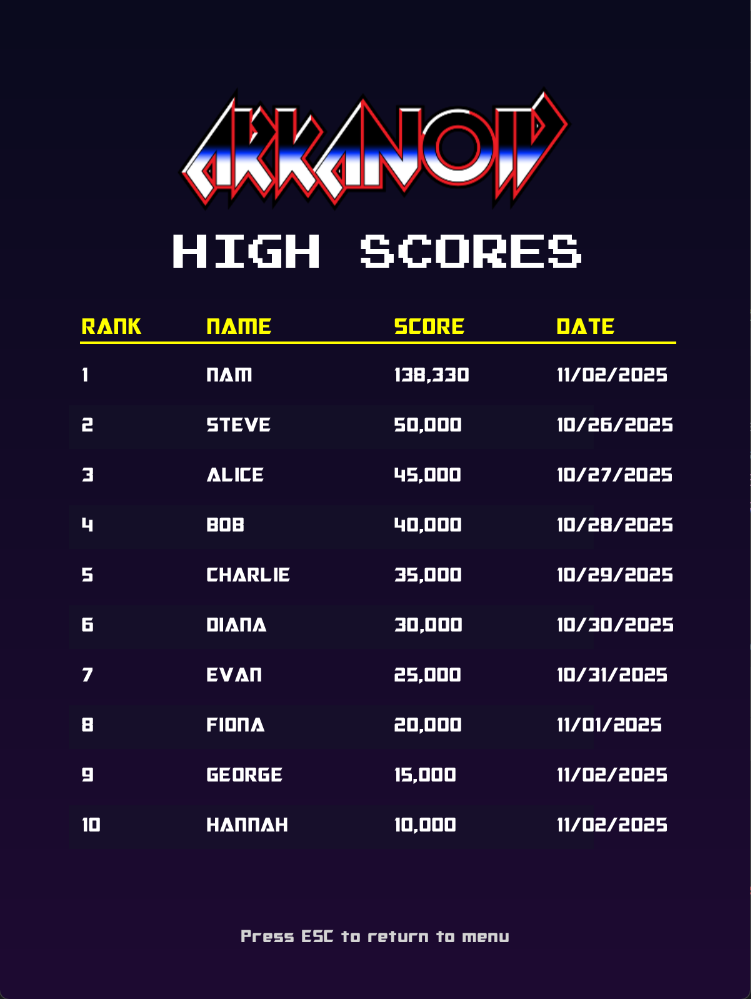
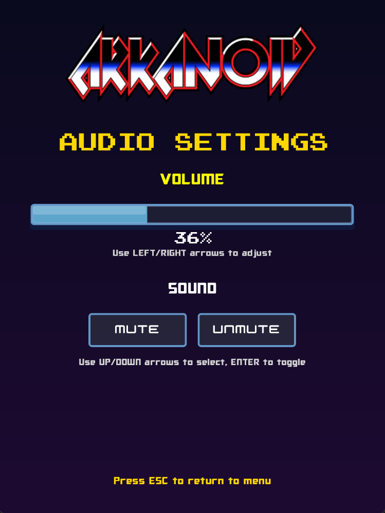

# 🎮 Arkanoid Game

<div align="center">


**Phiên bản JavaFX của game Arkanoid cổ điển với đồ họa đẹp mắt và gameplay mượt mà**

</div>

---

## 📋 Mục Lục

- [Giới thiệu](#-giới-thiệu)
- [Tính năng](#-tính-năng)
- [Cấu trúc dự án](#-cấu-trúc-dự-án)
- [Yêu cầu hệ thống](#-yêu-cầu-hệ-thống)
- [Cài đặt](#-cài-đặt)
- [Cách chơi](#-cách-chơi)
- [Power-ups](#-power-ups)
- [Kiến trúc game](#-kiến-trúc-game)
- [Công nghệ sử dụng](#-công-nghệ-sử-dụng)

---

## 🎯 Giới thiệu

**Arkanoid** là một game phá gạch (breakout) kinh điển được làm lại bằng Java và JavaFX. Người chơi điều khiển một thanh paddle để đập bóng phá các viên gạch trên màn hình. Game có nhiều cấp độ với độ khó tăng dần, hệ thống power-up đa dạng và âm thanh sống động.

Game này được phát triển theo hướng lập trình hướng đối tượng (OOP) với kiến trúc rõ ràng, dễ mở rộng và bảo trì.

---

## ✨ Tính năng

### 🎮 Gameplay
- **4+ vòng chơi** với độ khó tăng dần
- **Hệ thống điểm số** và bảng xếp hạng (High Score)
- **Nhiều loại gạch**: Normal, Silver, Gold với điểm số và độ bền khác nhau
- **Vật lý bóng chân thực** với xử lý va chạm chính xác
- **Hệ thống mạng sống** (mặc định 3 mạng, tối đa 5)

### 🎁 Power-ups (Vật phẩm hỗ trợ)
- 🎯 **Catch** - Bắt và giữ bóng trên paddle
- 🔄 **Duplicate** - Nhân đôi số lượng bóng
- ↔️ **Expand** - Mở rộng paddle
- 🔫 **Laser** - Bắn laser phá gạch
- ❤️ **Life** - Thêm mạng sống
- 🐌 **Slow** - Làm chậm tốc độ bóng
- 🌀 **Warp** - Chuyển sang cấp độ tiếp theo

### 🎨 Đồ họa & Âm thanh
- Đồ họa sprite đẹp mắt
- Hệ thống animation mượt mà
- Hiệu ứng âm thanh và nhạc nền
- Giao diện menu trực quan

### 🛠️ Kỹ thuật
- **60 FPS** gameplay mượt mà
- Quản lý trạng thái game (State Management)
- Hệ thống collision detection chính xác
- Sprite caching để tối ưu hiệu suất
- Lưu/tải high score

---

## 📁 Cấu trúc dự án

```
src/
├── ArkanoidGame/          # Lớp chính khởi chạy game
│   └── ArkanoidApp.java
├── Audio/                 # Quản lý âm thanh
│   └── MusicTrack.java
├── Engine/                # Core game engine
│   ├── AudioManager.java
│   ├── CollisionManager.java
│   ├── GameManager.java
│   ├── GameState.java
│   ├── HighScoreManager.java
│   ├── PowerUpManager.java
│   ├── RoundsManager.java
│   ├── ScoreManager.java
│   └── StateManager.java
├── GeometryPrimitives/    # Các đối tượng hình học cơ bản
│   ├── Line.java
│   ├── Point.java
│   ├── Rectangle.java
│   └── Velocity.java
├── Objects/               # Các đối tượng game
│   ├── Bricks/           # Các loại gạch
│   ├── Core/             # Base classes
│   ├── GameEntities/     # Ball, Paddle, Laser
│   └── PowerUps/         # Các loại power-up
├── Render/                # Hệ thống render
│   ├── Animation.java
│   ├── BorderRenderer.java
│   ├── CanvasRenderer.java
│   └── SpriteRenderer.java
├── Resources/             # Tài nguyên game
│   ├── Audio/
│   ├── Fonts/
│   └── Graphics/
├── Rounds/                # Các cấp độ game
│   ├── Round1.java
│   ├── Round2.java
│   ├── Round3.java
│   ├── Round4.java
│   └── RoundBase.java
├── UI/                    # Giao diện người dùng
│   ├── Button.java
│   ├── PowerUpDisplay.java
│   ├── Screen.java
│   ├── UIConstants.java
│   ├── UIHelper.java
│   ├── Menu/
│   └── Screens/
└── Utils/                 # Tiện ích
    ├── AnimationFactory.java
    ├── AssetLoader.java
    ├── Constants.java
    ├── FileManager.java
    ├── SpriteCache.java
    ├── SpriteCacheProvider.java
    └── SpriteProvider.java
```

---

## 💻 Yêu cầu hệ thống

- **Java**: JDK 17 hoặc cao hơn
- **JavaFX**: 21 hoặc cao hơn
- **RAM**: Tối thiểu 512MB
- **Hệ điều hành**: Windows, macOS, hoặc Linux
- **Màn hình**: Độ phân giải tối thiểu 800x600

---

## 🚀 Cài đặt

### Bước 1: Clone repository

```bash
git clone https://github.com/BoizSocSon/OOP-Project.git
cd OOP-Project
```

### Bước 2: Cài đặt JavaFX

Tải JavaFX SDK từ [https://openjfx.io/](https://openjfx.io/) và giải nén.

### Bước 3: Cấu hình IDE

#### IntelliJ IDEA:
1. Mở project trong IntelliJ
2. File → Project Structure → Libraries
3. Thêm JavaFX SDK vào project libraries
4. Run → Edit Configurations → Add VM options:
   ```
   --module-path "path/to/javafx-sdk/lib" --add-modules javafx.controls,javafx.fxml,javafx.media,javafx.graphics
   ```

#### Eclipse:
1. Mở project trong Eclipse
2. Right-click project → Build Path → Configure Build Path
3. Thêm JavaFX SDK external JARs
4. Run Configurations → Arguments → VM arguments: (giống như trên)

### Bước 4: Chạy game

Chạy class `ArkanoidApp.java` với module path đã cấu hình.

---

## 🎮 Cách chơi

### Điều khiển

- **←/→ (Mũi tên trái/phải)** hoặc **A/D**: Di chuyển paddle
- **Space**: 
  - Bắt đầu game / Phóng bóng
  - Bắn laser (khi có power-up Laser)
  - Thả bóng (khi có power-up Catch)
- **P**: Tạm dừng game
- **ESC**: Quay lại menu chính

### Luật chơi

1. Sử dụng paddle để đập bóng phá gạch
2. Phá hết gạch để qua cấp độ tiếp theo
3. Hứng power-up (các viên nén rơi xuống) để nhận hỗ trợ
4. Không để bóng rơi xuống đáy (mất 1 mạng và -500 điểm)
5. Hết mạng = Game Over

### Ghi điểm

| Đối tượng | Điểm                     |
|-----------|--------------------------|
| Normal Brick | 60 - 130 (cần đập 1 lần) |
| Silver Brick (Bạc) | 50 (cần đập 2 lần)       |
| Gold Brick (Vàng) | 50 (không thể phá)       |
| Mất mạng | -500                     |

**Chi tiết cách chơi được ghi trong file [HowToPlay](docs/HowToPlay.txt)**

---

## 🎁 Power-ups

| Icon | Tên | Mô tả | Xác suất |
|------|-----|-------|----------|
| 🎯 | **Catch** | Bắt và giữ bóng trên paddle, nhấn Space để phóng | 15% |
| 🔄 | **Duplicate** | Tạo thêm bóng (nhân đôi số lượng bóng) | 12% |
| ↔️ | **Expand** | Mở rộng kích thước paddle | 15% |
| 🔫 | **Laser** | Trang bị laser cho paddle, nhấn Space để bắn | 15% |
| ❤️ | **Life** | Thêm 1 mạng sống (tối đa 5) | 5% |
| 🐌 | **Slow** | Làm chậm tốc độ di chuyển của bóng | 15% |
| 🌀 | **Warp** | Chuyển ngay sang cấp độ tiếp theo | 1% |

---

## 🏗️ Kiến trúc game

### Design Patterns

Game sử dụng các design patterns phổ biến:

- **State Pattern**: Quản lý các trạng thái game (Menu, Playing, Paused, Game Over)
- **Factory Pattern**: `AnimationFactory` để tạo animations
- **Singleton Pattern**: `AudioManager`, `HighScoreManager` để quản lý tài nguyên toàn cục
- **Observer Pattern**: Các managers theo dõi sự kiện game
- **Strategy Pattern**: Các loại gạch và power-up có behavior khác nhau

### Core Systems

1. **GameManager**: Điều phối toàn bộ logic game
2. **CollisionManager**: Xử lý va chạm giữa các đối tượng
3. **RoundsManager**: Quản lý các cấp độ
4. **PowerUpManager**: Xử lý logic power-up
5. **AudioManager**: Quản lý âm thanh
6. **CanvasRenderer**: Render toàn bộ đồ họa

### Game Loop

Game chạy với AnimationTimer của JavaFX ở 60 FPS:

```
┌─────────────────────────────────────┐
│         Game Loop (60 FPS)          │
├─────────────────────────────────────┤
│  1. Xử lý Input (Keyboard)          │
│  2. Cập nhật Logic (Update)         │
│     - Di chuyển đối tượng           │
│     - Kiểm tra va chạm              │
│     - Cập nhật power-up             │
│  3. Render (Draw)                   │
│     - Vẽ background                 │
│     - Vẽ game objects               │
│     - Vẽ UI                         │
└─────────────────────────────────────┘
```

---

## 🛠️ Công nghệ sử dụng

- **Ngôn ngữ**: Java 17+
- **Framework UI**: JavaFX 21
- **Build System**: Module System (Java 9+)
- **Graphics**: JavaFX Canvas API
- **Audio**: JavaFX Media API
- **Animation**: JavaFX AnimationTimer
- **File I/O**: Java NIO

---

## 📝 Nhóm tác giả phát triển
| Vai trò | Tên | Mã Sinh Viên | GitHub Profile |
|---------|-----|--------------|----------------|
| Trưởng nhóm | Hoàng Nhật Nam | 23020845 | [BoizSocSon](https://github.com/BoizSocSon) |
| Thành viên | Đặng Bá Quân | 23020860 | [QuanCris](https://github.com/QuanCris) |
| Thành viên | Phùng Văn Quang | 23020861 | [23020861-code](https://github.com/23020861-code) |

---

## 📄 License

Project này được phát hành dưới MIT License. Xem file [`LICENSE`](LICENSE) để biết thêm chi tiết.

---

## 🙏 Acknowledgments

- Game gốc Arkanoid của Taito Corporation
- JavaFX community
- Tất cả các nghệ sĩ tạo sprite và nhà sản xuất âm thanh

---

## 📸 Screenshots

_Thêm screenshots của game vào đây_

### Menu Chính

*Giao diện menu chính với các tùy chọn New Game, High Scores và Settings*

### Gameplay

#### Round 1
\
*Vòng chơi đầu tiên với bố cục gạch đơn giản*

#### Round 2
\
*Vòng 2 với độ khó tăng dần và nhiều gạch hơn*

#### Round 3
\
*Vòng 3 với pattern phức tạp*

#### Round 4
\
*Vòng 4 - thử thách khó nhất với nhiều gạch Silver và Gold*

### Game States

#### Pause
\
*Màn hình tạm dừng game*

#### Game Over
\
*Màn hình Game Over hiển thị điểm số cuối cùng*

#### Victory
\
*Màn hình chiến thắng khi hoàn thành game*

### Các tính năng khác

#### High Scores
\
*Bảng xếp hạng điểm cao nhất*

#### Settings
\
*Màn hình cài đặt âm thanh và các tùy chọn game*

---

## 🔮 Tính năng tương lai

- [ ] Thêm nhiều vòng chơi hơn
- [ ] Chế độ multiplayer
- [ ] Leaderboard online
- [ ] Thêm power-up mới
- [ ] Chế độ endless
- [ ] Boss battles
- [ ] Customizable themes

---

<div align="center">

**⭐ Nếu bạn thích project này, hãy cho một star! ⭐**

Made with ❤️ and ☕

</div>
